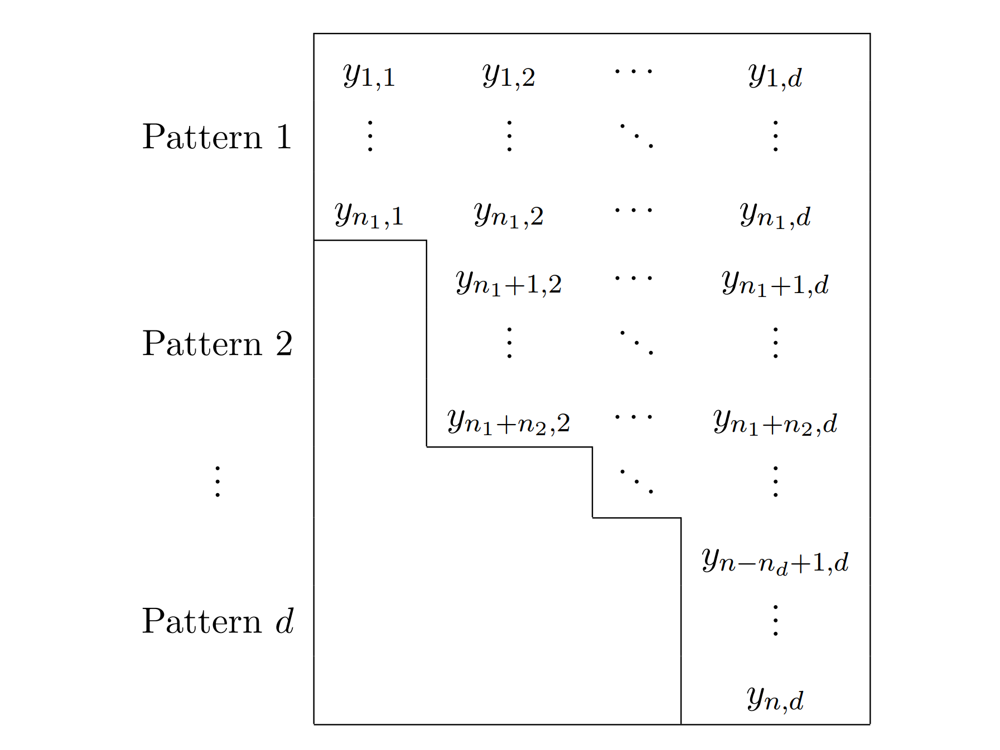

```{r setup, include = FALSE}
knitr::opts_chunk$set(
  collapse = TRUE,
  comment = "#>"
)
knitr::opts_chunk$set(echo = TRUE)
```

This vignette is an introduction of Bayesian robust multivariate linear regression (with possible incomplete data), and the data augmentation algorithms to sample from the posterior. See our [paper](http://arxiv.org/abs/2212.01712) for technical details.

# Introduction

## Model

Consider the multivariate linear regression model
$$ 
  \mathbf{Y}_i = \mathbf{B}^T \mathbf{x}_i + \mathbf{\Sigma}^{1/2} \mathbf{\varepsilon}_i,\ i \in \{1,\dots,n\},  
$$

To model possible influential observations in normal errors, we use error distributions with heavy tails.
Assume that the distribution of each $\mathbf{\varepsilon}_i$ is described by a scale mixture of multivariate normal densities, which takes the form
$$
f_{\text{err}}(\mathbf{\epsilon}) = \int_{0}^{\infty} \frac{w^{d/2}}{(2\pi)^{d/2}} \exp \left(-\frac{w}{2} \mathbf{\epsilon}^{T} \mathbf{\epsilon} \right) P_{mix}( w) , \quad \mathbf{\epsilon} \in \mathbb{R}^d.  
$$
$P_{mix}(\cdot)$ is a probability measure function on $\mathbb{R}^+$ referred to as the mixing distribution. 
Gaussian mixtures constitute a variety of error distributions and are widely used for robust regression.
For instance, when $P_{mix}(\cdot)$ corresponds to the $\text{Gamma}(v/2,v/2)$ distribution for some $v > 0$, the errors follow the multivariate $t$ distribution with $v$ degrees of freedom.


Consider a Bayesian setting.
Assume that $(\mathbf{B},\mathbf{\Sigma})$ has the  following prior density:
$$
	p_{\scriptsize\mbox{prior}}(\mathbf{\beta}, \mathbf{\varsigma})  	\propto |\mathbf{\varsigma}|^{-(m+1)/2} \exp \left[-\frac{1}{2} \operatorname{tr} \left(\mathbf{\varsigma}^{-1} \mathbf{a} \right)\right], \quad \mathbf{\beta} \in \mathbb{R}^{p \times d}, \; \mathbf{\varsigma} \in S_+^{d \times d},
$$
where $m\in \mathbb{R}$, $\mathbf{a} \in S_+^{d \times d}$, and $S_+^{d \times d}$ is the convex cone of $d \times d$ (symmetric) positive semi-definite real matrices.  For instance, the independence Jeffrey's prior corresponds to $m=d$ and $\mathbf{a}=0$, and the non-informative constant prior corresponds to $m=-1$ and $\mathbf{a}=0$.


## Incomplete Data

we assume that the missing data mechanism is ignorable, which is true if the missing structure does not depend on model parameters and is independent of the data values.

A missing structure is said to be monotone if it can be sorted into the following format after permuting the rows and columns.
{width=250px}
The data without missing values is monotone.

The \code{ismonotone} function helps check whether the data is monotone or not and permutes the rows and columns of the data to the standard monotone format. 

```{r}
# 1 not monotone
a = c(NA, 1,4,NA,5,9)
b = c(2, NA, 3,5,6,NA)
c = c(2,4,6,NA, 5,6)
data = data.frame(a,b,c)
ismonotone(data)
```


## The Data Augmentation Algorithms

The posterior is almost always intractable in the sense that it is hard to calculate its features such as expectation and quantiles, forcing the use of MCMC samplers.
[Liu, 1996](https://www.jstor.org/stable/2291740) proposed a data augmentation (DA) algorithm, or two-component Gibbs sampler, that can be used to sample from this distribution under monotone missing patterns. The algorithms contain two steps, the I step and the P step.


When the missing data have a certain ``monotone" structure, the DA algorithm can be carried out without an intermediate step to impute the missing data.

When the missing data do not possess a monotone structure, some missing entries need to be imputed if one wishes to implement the DA algorithm. We call this data augmentation algorithm with an intermediate imputation step (DAI).
Let $\textbf{k}$ be the missing structure of $\textbf{y}$. Users have to specify a larger missing structure  $\textbf{k}'$, which represents the missing structure after mandatory imputation. $\textbf{k}'$ is larger than $\textbf{k}$ if all elements observed under $\textbf{k}$ are also observed under $\textbf{k}'$. 


In the R functions. the missing structure $\textbf{k}'$ corresponds to $Ik$, and $\textbf{k}$ corresponds to $I$.
Users can use function \code{dageneral} to implement these algorithms. It will automatically find the best fit to sample from the posterior.

To make sure the algorithm can be implemented efficiently, we need two weak conditions. The conditions are true in most situations. See the [paper](http://arxiv.org/abs/2212.01712) Condition H1 and H2, and Proposition 3 for more details. 
We also develop conditions to guarantee a proper posterior. See the [paper](http://arxiv.org/abs/2212.01712) Theorem 7.


# R Implementation

## Illustrative Example

The creatinine clearance data is introduced by Shih and Weisberg (1986), and is used in an illustrative example by Liu (1996).

The data are from a clinical trial on 34 male patients with body weight (WT) in kg, serum creatinine (SC) concentration in mg/deciliter, age (AGE) in years, and endogenous creatinine (CR) clearance. Of the 34 male patients, 2 had no record in WT and 4 were missing SC. The missingness is assumed to be ignorable.
There is one influential observation patient 27.


### Step 1 Missing structure

Check whether the data is monotone or not after permuting the rows and columns.

```{r}
set.seed(1)
library(Bayesianrobust) # load our package
mon <- ismonotone(creatinine_data)
```
The data is not monotone

```{r}
mon$monotone
```
Response data (after rearranging the rows and columns).

When the missing structure is monotone. Use the rearranged data for later analysis, since the data is required be in the standard monotone format. 

When the missing structure is not monotone. It is suggested to use the rearranged data. The results are the same, and the permuted version displays the missing structure better.


```{r}
data <- mon$ynew
```

Shows the locations of the rows and columns in the original data.

```{r}
mon$ynew_column
```
```{r}
mon$ynew_row
```

### Implement the data augmentation algorithms


```{r}

```


## how complex can the problem be implementable?


# Appendix

## Data Augmenatation Algorithms Comparison 
```{r}
set.seed(1)
library(GeneralizedHyperbolic)
library(LaplacesDemon)
library(matlib)
library(MASS)
library(matrixNormal)
library(ggplot2)
# generate data
library(mvtnorm)
n <- 50
X <- cbind(1, as.matrix(rnorm(n, 0, 1)))
beta <- matrix(c(0.8, 0.4, 0.5, 0.3), nrow=2, ncol=2)
var <- matrix(c(1, 0.6, 0.6, 2), 2, 2)
error <- matrix(0, nrow=n, ncol=2)
w <- rgamma(n, shape=2, rate=2)
for (i in 1:n) {
  error[i, ] <- rmvnorm(1, rep(0, nrow(var)), var / w[i])
}
yobs <- X %*% beta + error
data <- cbind(yobs, X[, 2])
data_d <- cbind(X[, 2], yobs)
colnames(data_d) <- c("x", "yr1", "yr2")

# display data
library(GGally)
ggpairs(data.frame(data_d))
# ggsave("scatter.png", width=150, height=100, dpi=700, units="mm")
rm(data_d)
```


```{r}
# Parameters
d <- ncol(yobs)
m <- d # prior parameter
A <- matrix(0, nrow=d, ncol=d) # matrix in the prior

iter <- 1000
lower <- 1 # burn-in
upper <- iter + 1
dim <- 2 # beta_21 
```


```{r}
# Bayesian robust multivariate linear regression DA algorithm
## There is no missing value. In this situation, the mda_gibbs and dami_gibbs coincide.
## cw_gamma default is gamma(2, 2)
resdag <- dageneral(X, yobs, m, A, cw=cw_gamma, iter=iter) # da monotone
resdaig <- dageneral(X, yobs, m, A, cw=cw_gamma, Ik=matrix(TRUE, nrow=nrow(yobs), ncol=ncol(yobs)),  iter=iter) # daimf fully observed

# plot histogram
sim <- data.frame(Model=rep(c("dag", "daimfg"), each=(upper - lower + 1)), beta=c(resdag$samples[lower:upper, dim], resdaig$samples[lower:upper, dim]))
ggplot(sim, aes(x=beta, color=Model)) + geom_density() + xlab("Beta") + ylab("Density")
```


```{r}
# create monotone missing data
for (i in c(47:50)) {
  yobs[i, 1] <- NA
}

# implement
resdag <- dageneral(X, yobs, m, A, cw=cw_gamma, iter=iter) # da monotone
resdaig <- dageneral(X, yobs, m, A, cw=cw_gamma,
Ik=matrix(TRUE, nrow=nrow(yobs), ncol=ncol(yobs)),  iter=iter) # daimf monotone and impute to fully observed

# plot histogram
sim <- data.frame(Model=rep(c("dag", "daig"), each=(upper - lower + 1)), beta=c(resdag$samples[lower:upper, dim], resdaig$samples[lower:upper, dim]))
ggplot(sim, aes(x=beta, color=Model)) + geom_density() + xlab("Beta") + ylab("Density")
```

```{r}
# impute missing response values
resdagy <- dageneral(X, yobs, m, A, cw=cw_gamma, iter=iter, yfull=TRUE)
resdaigy <- dageneral(X, yobs, m, A, cw=cw_gamma,
Ik=matrix(TRUE, nrow=nrow(yobs), ncol=ncol(yobs)),  iter=iter, yfull=TRUE) # daimf# da
id <- ncol(resdagy$samples)
# plot histogram
sim <- data.frame(Model=rep(c("dag", "daimfg"), each=(upper - lower + 1)), beta=c(resdagy$samples[lower:upper, id], resdaigy$samples[lower:upper, id]))
ggplot(sim, aes(x=beta, color=Model)) + geom_density() + xlab("yimputed") + ylab("Density")
```


```{r}
# create non-monotone missing data
for (i in c(47:50)) {
  yobs[i, 1] <- NA
}

yobs[45, 2] <- NA
Ik <- !is.na(yobs)
Ik[45, 2] <- TRUE

# implement
resdaig <- dageneral(X, yobs, m, A, cw=cw_gamma, Ik=Ik, iter=iter) # dai
resdaifg <- dageneral(X, yobs, m, A, cw=cw_gamma, iter=iter) # daif

# plot histogram
sim <- data.frame(Model=rep(c("daig", "daifg"), each=(upper - lower + 1)), beta=c(resdag$samples[lower:upper, dim], resdaig$samples[lower:upper, dim]))
ggplot(sim, aes(x=beta, color=Model)) + geom_density() + xlab("Beta") + ylab("Density")
```


# References


Li, Haoxiang, Qian Qin, and Galin L. Jones. "Convergence Analysis of Data Augmentation Algorithms for Bayesian Robust Multivariate Linear Regression with Incomplete Data." arXiv preprint arXiv:2212.01712 (2022).

Liu, Chuanhai. "Bayesian robust multivariate linear regression with incomplete data." Journal of the American Statistical Association 91.435 (1996): 1219-1227.

Shih, Weichung J., and Sanford Weisberg. "Assessing influence in multiple linear regression with incomplete data." Technometrics 28.3 (1986): 231-239.
